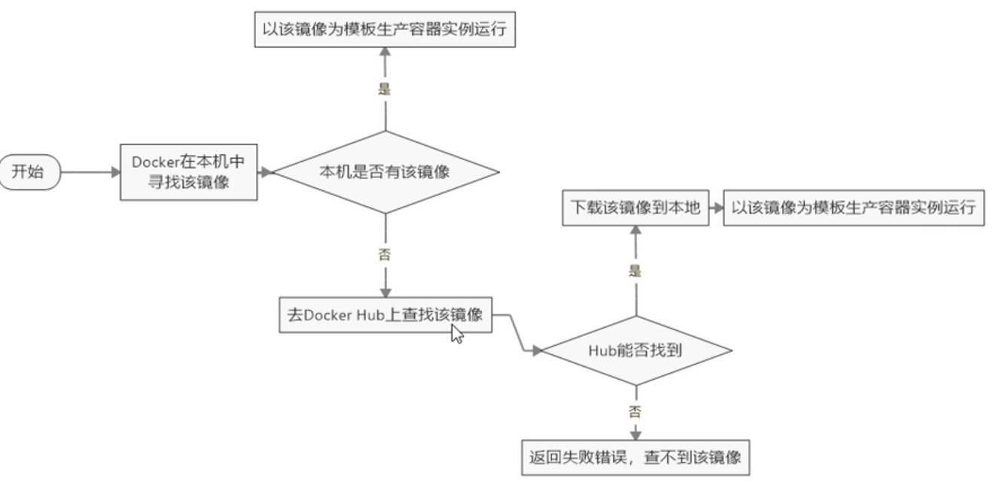

# 基础

## 是什么

### docker为什么出现

在部署过程中不出现令人头疼的版本、配置、移植应用问题，也无需重新编写代码和进行故障修复？ 答案就是**使用容器**。

Docker之所以发展如此迅速，也是因为它对此给出了一个标准化的解决方案-----**系统平滑移植，容器虚拟化技术**。 软件可以带环境安装。也就是说，安装的时候，把原始环境一模一样地复制过来。

开发人员利用 Docker 可以消除协作编码时“在我的机器上可正常工作”的问题。 

Docker的出现使得Docker得以打破过去「程序即应用」的观念。透过镜像(images)将作业系统核心除外，运作应用程式所需要的系统环境，由下而上打包，达到应用程式跨平台间的无缝接轨运作。

**为什么Docker会比VM虚拟机快？**

(1)docker有着比虚拟机更少的抽象层  

由于docker不需要Hypervisor(虚拟机)实现**硬件资源虚拟化**,运行在docker容器上的程序直接使用的都是实际物理机的硬件资源。因此在CPU、内存利用率上docker将会在效率上有明显优势。

(2)docker利用的是宿主机的内核,而不需要加载操作系统OS内核  

当新建一个容器时,docker不需要和虚拟机一样重新加载一个操作系统内核。进而避免引寻、加载操作系统内核返回等比较费时费资源的过程,当新建一个虚拟机时,虚拟机软件需要加载OS,返回新建过程是分钟级别的。而docker由于直接利用宿主机的操作系统,则省略了返回过程,因此新建一个docker容器只需要几秒钟。  

### docker理念

Docker是基于Go语言实现的云开源项目。Docker的主要目标是“Build，Ship and Run Any App,Anywhere”，也就是通过对应用组件的封装、分发、部署、运行等生命周期的管理，使用户的APP（可以是一个WEB应用或数据库应用等等）及其运行环境能够做到“**一次镜像，处处运行**”。

Linux容器技术的出现就解决了这样一个问题，而 Docker 就是在它的基础上发展过来的。将应用打成镜像，通过镜像成为运行在Docker容器上面的实例，而 **Docker容器在任何操作系统上都是一致的**，这就实现了跨平台、跨服务器。只需要一次配置好环境，换到别的机子上就可以一键部署好，大大简化了操作。

### docker组成

**镜像(image)**

Docker 镜像（Image）就是一个只读的模板。**镜像可以用来创建 Docker 容器**，一个镜像可以创建很多容器。它也相当于是一个root文件系统。比如官方镜像 centos:7 就包含了完整的一套 centos:7 最小系统的 root 文件系统。相当于容器的“源代码”，docker镜像文件类似于Java的类模板，而docker容器实例类似于java中new出来的实例对象。  

**容器(container)**

 1 从面向对象角度

Docker 利用容器（Container）独立运行的一个或一组应用，**应用程序或服务运行在容器里面**，容器就类似于一个虚拟化的运行环境，容器是用镜像创建的运行实例。就像是Java中的类和实例对象一样，镜像是静态的定义，容器是镜像运行时的实体。容器为镜像提供了一个标准的和隔离的运行环境，它可以被启动、开始、停止、删除。每个容器都是相互隔离的、保证安全的平台

 2 从镜像容器角度可以把容器看做是一个简易版的 Linux 环境（包括root用户权限、进程空间、用户空间和网络空间等）和运行在其中的应用程序。

**仓库(repository)**

 仓库（Repository）是集中存放镜像文件的场所。 类似于Maven仓库，存放各种jar包的地方；github仓库，存放各种git项目的地方；Docker公司提供的官方registry被称为Docker Hub，存放各种镜像模板的地方。 仓库分为公开仓库（Public）和私有仓库（Private）两种形式。最大的公开仓库是 Docker Hub(https://hub.docker.com/)，存放了数量庞大的镜像供用户下载。国内的公开仓库包括阿里云 、网易云等

**总结**

需要正确的理解仓库/镜像/容器这几个概念:

Docker 本身是一个容器运行载体或称之为管理引擎。我们把应用程序和配置依赖打包好形成一个可交付的运行环境，这个打包好的运行环境就是image镜像文件。只有通过这个镜像文件才能生成Docker容器实例(类似Java中new出来一个对象)。 

image文件可以看作是容器的模板。Docker 根据 image 文件生成容器的实例。同一个 image 文件，可以生成多个同时运行的容器实例。 

**镜像文件***  image 文件生成的容器实例，本身也是一个文件，称为镜像文件。

**容器实例***  一个容器运行一种服务，当我们需要的时候，就可以通过docker客户端创建一个对应的运行实例，也就是我们的容器

**仓库*** 就是放一堆镜像的地方，我们可以把镜像发布到仓库中，需要的时候再从仓库中拉下来就可以了。 

### docker架构:pensive:

**入门版**


Docker 是一个 C/S 模式的架构，后端是一个松耦合架构，众多模块各司其职。 

**详细版**

## 虚拟机与容器

**容器发展**


**传统虚拟技术**

虚拟机（virtual machine）就是带环境安装的一种解决方案。

它可以在一种操作系统里面运行另一种操作系统，比如在Windows10系统里面运行Linux系统CentOS7。应用程序对此毫无感知，因为虚拟机看上去跟真实系统一模一样，而对于底层系统来说，虚拟机就是一个普通文件，不需要了就删掉，对其他部分毫无影响。

这类虚拟机完美的运行了另一套系统，能够使应用程序，操作系统和硬件三者之间的逻辑不变。 Win10VMWareCentos7各种cpu、内存网络额配置+各种软件虚拟机实例 虚拟机的缺点：1   资源占用多        2   冗余步骤多         3   启动慢

**容器虚拟化技术**

由于前面虚拟机存在某些缺点，Linux发展出了另一种虚拟化技术：

**Linux容器(Linux Containers，缩写为 LXC)**

Linux容器是与系统其他部分隔离开的一系列进程，从另一个镜像运行，并由该**镜像提供支持进程所需的全部文件**。容器提供的镜像包含了应用的所有依赖项，因而在从开发到测试再到生产的整个过程中，它都具有可移植性和一致性。 

Linux 容器不是模拟一个完整的操作系统而是**对进程进行隔离**。有了容器，就可以将软件运行所需的所有资源打包到一个隔离的容器中。**容器与虚拟机不同，不需要捆绑一整套操作系统，只需要软件工作所需的库资源和设置。系统因此而变得高效轻量并保证部署在任何环境中的软件都能始终如一地运行。** 

**对比**

 比较了 Docker 和传统虚拟化方式的不同之处：

*传统虚拟机技术是虚拟出一套硬件后，在其上运行一个完整操作系统，在该系统上再运行所需应用进程；*

容器内的应用进程直接运行于宿主的内核，容器内没有自己的内核且也没有进行硬件虚拟。因此容器要比传统虚拟机更为轻便。

每个容器之间互相隔离，每个容器有自己的文件系统 ，容器之间进程不会相互影响，能区分计算资源。

## 作用

开发/运维(DecOps),一次构建、随处运行

## 安装

docker官网：http://www.docker.com

Docker Hub官网: https://hub.docker.com/

**CentOS Docker 安装**前提条件目前，CentOS 仅发行版本中的内核支持 Docker。

Docker 运行在CentOS 7 (64-bit)上，要求系统为64位、Linux系统内核版本为 3.8以上

**查看内核版本**

```shell
uname -r
```

### CentOS7安装

**文档地址**

https://docs.docker.com/engine/install/centos/

**设置镜像**

yum-config-manager --add-repo http://mirrors.aliyun.com/docker-ce/linux/centos/docker-ce.repo

**设置镜像仓库之后**

更新yum软件包索引：yum makecache fast

**安装docker容器**

> 参考官方文档

**配置阿里云容器加速**


docker run hello-world

run干了什么



## docker常用命令

```shell
# 帮助启动类命令
启动docker： systemctl start docker
停止docker： systemctl stop docker
重启docker： systemctl restart docker
查看docker状态： systemctl status docker
开机启动： systemctl enable docker
查看docker概要信息： docker info
查看docker总体帮助文档： docker --help
查看docker命令帮助文档： docker 具体命令 --help


# 镜像命令
docker images #列出本地主机上的镜像，
-a #:列出本地所有的镜像（含历史映像层）
-q #:只显示镜像ID。
#各个选项说明:
# REPOSITORY：表示镜像的仓库源
# TAG：镜像的标签版本号
# IMAGE ID：镜像ID
# CREATED：镜像创建时间
# SIZE：镜像大小 
# 同一仓库源可以有多个 TAG版本，代表这个仓库源的不同个版本，我们使用 REPOSITORY:TAG 来定义不同的镜像。如果你不指定一个镜像的版本标签，例如你只使用 ubuntu，docker 将默认使用 ubuntu:latest 镜像  
docker search [OPTIONS] 镜像名字
--limit #: 只列出N个镜像，默认25个
docker search --limit 5 redis
docker pull 镜像名字[:TAG] #下载镜像，没有TAG就是最新版，等价于docker pull 镜像名字:latest
docker system df #查看镜像/容器/数据卷所占的空间
docker rmi  -f 镜像ID					#删除单个
docker rmi -f 镜像名1:TAG 镜像名2:TAG  #删除多个
docker rmi -f $(docker images -qa)   #删除全部


#有镜像才能创建容器，这是根本前提(下载一个CentOS或者ubuntu镜像演示)
docker pull ubuntu
docker run [OPTIONS] IMAGE [COMMAND] [ARG...]
#OPTIONS说明（常用）：有些是一个减号，有些是两个减号 
	--name="容器新名字"       为容器指定一个名称；
	-d: 后台运行容器并返回容器ID，也即启动守护式容器(后台运行)； 
	
	-i：interactive以交互模式运行容器，通常与 -t 同时使用；
	-t：tty为容器重新分配一个伪输入终端，通常与 -i 同时使用；
	也即启动交互式容器(前台有伪终端，等待交互)；
	docker run -it ubuntu /bin/bash
	#参数说明：-i: 交互式操作。-t: 终端。centos : centos 镜像。/bin/bash：放在镜像名后的是命令，这里我们希望有个交互式 Shell，因此用的是 /bin/bash。要退出终端，直接输入 exit: 
	
    -P: 随机端口映射，大写P
    -p: 指定端口映射，小写p
    
docker ps [OPTIONS] #列出当前所有正在运行的容器
#OPTIONS说明（常用）： 
	-a :列出当前所有正在运行的容器+历史上运行过的
	-l :显示最近创建的容器。
	-n：显示最近n个创建的容器。
	-q :静默模式，只显示容器编号。
	
#退出容器
exit #run进去容器，exit退出，容器停止
ctrl+p+q #run进去容器，ctrl+p+q退出，容器不停止
docker start 容器ID或者容器名 #启动已停止运行的容器
docker restart 容器ID或者容器名	#重启容器
docker stop 容器ID或者容器名	#停止容器
docker kill 容器ID或容器名	#强制停止容器
docker rm 容器ID	#删除已停止的容器
#一次性删除多个容器实例
docker rm -f $(docker ps -a -q)
docker ps -a -q | xargs docker rm


#重要
#启动守护式容器(后台服务器)
docker run -d 容器名
docker run -d redis:6.0.8
#使用镜像centos:latest以后台模式启动一个容器docker run -d centos 
#问题：然后docker ps -a 进行查看, 会发现容器已经退出
#很重要的要说明的一点: Docker容器后台运行,就必须有一个前台进程.容器运行的命令如果不是那些一直挂起的命令（比如运行top，tail），就是会自动退出的。 
#这个是docker的机制问题,比如你的web容器,我们以nginx为例，正常情况下,我们配置启动服务只需要启动响应的service即可。例如service nginx start但是,这样做,nginx为后台进程模式运行,就导致docker前台没有运行的应用,这样的容器后台启动后,会立即自杀因为他觉得他没事可做了.
#所以，最佳的解决方案是,将你要运行的程序以前台进程的形式运行，常见就是命令行模式，表示我还有交互操作，别中断

docker logs 容器ID	#查看容器日志
docker top 容器ID		#查看容器内运行的进程
docker inspect 容器ID #查看容器内部细节
docker exec -it 容器ID bashShell	#进入正在运行的容器并以命令行交互	推荐----------
docker attach 容器ID	#重新进入
# 比较
attach 直接进入容器启动命令的终端，不会启动新的进程
用exit退出，会导致容器的停止。

exec 是在容器中打开新的终端，并且可以启动新的进程
用exit退出，不会导致容器的停止。

# eg:
docker exec -it 容器ID /bin/bash
docker exec -it 容器ID redis-cli

docker cp  容器ID:容器内路径 目的主机路径	#从容器内拷贝文件到主机上

#导入和导出容器
#export 导出容器的内容留作为一个tar归档文件[对应import命令]
#import 从tar包中的内容创建一个新的文件系统再导入为镜像[对应export]
docker export 容器ID > 文件名.tar
cat 文件名.tar | docker import - 镜像用户/镜像名:镜像版本号

docker commit	#提交容器副本使之成为一个新的镜像
docker commit -m="提交的描述信息" -a="作者" 容器ID 要创建的目标镜像名:[标签名]


build     Build an image from a Dockerfile              # 通过 Dockerfile 定制镜像
commit    Create a new image from a container changes   # 提交当前容器为新的镜像
cp        Copy files/folders from the containers filesystem to the host path   #从容器中拷贝指定文件或者目录到宿主机中
create    Create a new container                        # 创建一个新的容器，同 run，但不启动容器
diff      Inspect changes on a container's filesystem   # 查看 docker 容器变化
events    Get real time events from the server          # 从 docker 服务获取容器实时事件
exec      Run a command in an existing container        # 在已存在的容器上运行命令
history   Show the history of an image                  # 展示一个镜像形成历史images    
info      Display system-wide information               # 显示系统相关信息
inspect   Return low-level information on a container   # 查看容器详细信息
kill      Kill a running container                      # kill 指定 docker 容器
load      Load an image from a tar archive              # 从一个 tar 包中加载一个镜像[对应 save]
login     Register or Login to the docker registry server    # 注册或者登陆一个 docker 源服务器
logout    Log out from a Docker registry server          # 从当前 Docker registry 退出
logs      Fetch the logs of a container                 # 输出当前容器日志信息
port      Lookup the public-facing port which is NAT-ed to PRIVATE_PORT    # 查看映射端口对应的容器内部源端口
pause     Pause all processes within a container        # 暂停容器ps        
push      Push an image or a repository to the docker registry server    # 推送指定镜像或者库镜像至docker源服务器
rm        Remove one or more containers                 # 移除一个或者多个容器
rmi       Remove one or more images       # 移除一个或多个镜像[无容器使用该镜像才可删除，否则需删除相关容器才可继续或 -f 强制删除]
run       Run a command in a new container              # 创建一个新的容器并运行一个命令
save      Save an image to a tar archive                # 保存一个镜像为一个 tar 包[对应 load]
search    Search for an image on the Docker Hub         # 在 docker hub 中搜索镜像
tag       Tag an image into a repository                # 给源中镜像打标签
top       Lookup the running processes of a container   # 查看容器中运行的进程信息
unpause   Unpause a paused container                    # 取消暂停容器
version   Show the docker version information           # 查看 docker 版本号
wait      Block until a container stops, then print its exit code   # 截取容器停止时的退出状态值 
```

## Docker镜像

### 什么是镜像

镜像是一种轻量级、可执行的独立软件包，它包含运行某个软件所需的所有内容，我们把应用程序和配置依赖打包好形成一个可交付的运行环境(包括代码、运行时需要的库、环境变量和配置文件等)，这个打包好的运行环境就是image镜像文件。 只有通过这个镜像文件才能生成Docker容器实例(类似Java中new出来一个对象)。 

### 分层镜像

 以我们的pull为例，在下载的过程中我们可以看到docker的镜像好像是在一层一层的在下载 


### UnionFS（联合文件系统）

UnionFS（联合文件系统）：Union文件系统（UnionFS）是一种分层、轻量级并且高性能的文件系统，它支持对文件系统的修改作为一次提交来一层层的叠加，同时可以将不同目录挂载到同一个虚拟文件系统下(unite several directories into a single virtual filesystem)。

Union 文件系统是 Docker 镜像的基础。镜像可以通过分层来进行继承，基于基础镜像（没有父镜像），可以制作各种具体的应用镜像。 

特性：一次同时加载多个文件系统，但从外面看起来，只能看到一个文件系统，联合加载会把各层文件系统叠加起来，这样最终的文件系统会包含所有底层的文件和目录

###  Docker镜像加载原理

 Docker镜像加载原理：  docker的镜像实际上由一层一层的文件系统组成，这种层级的文件系统UnionFS。

bootfs(boot file system)主要包含bootloader和kernel, bootloader主要是引导加载kernel, Linux刚启动时会加载bootfs文件系统，在Docker镜像的最底层是引导文件系统bootfs。这一层与我们典型的Linux/Unix系统是一样的，包含boot加载器和内核。当boot加载完成之后整个内核就都在内存中了，此时内存的使用权已由bootfs转交给内核，此时系统也会卸载bootfs。

 rootfs (root file system) ，在bootfs之上。包含的就是典型 Linux 系统中的 /dev, /proc, /bin, /etc 等标准目录和文件。rootfs就是各种不同的操作系统发行版，比如Ubuntu，Centos等等。 。

 

**平时我们安装进虚拟机的CentOS都是好几个G，为什么docker这里才200M？？**

对于一个精简的OS，rootfs可以很小，只需要包括最基本的命令、工具和程序库就可以了，因为底层直接用Host的kernel，自己只需要提供 rootfs 就行了。由此可见对于不同的linux发行版, bootfs基本是一致的, rootfs会有差别, 因此不同的发行版可以公用bootfs。 

### 镜像分层好处

 镜像分层最大的一个好处就是**共享资源，方便复制迁移，就是为了复用**。 比如说有多个镜像都从相同的 base 镜像构建而来，那么 Docker Host 只需在磁盘上**保存一份 base 镜像**；同时内存中也只需加载一份 base 镜像，就可以为所有容器服务了。而且镜像的每一层都可以被共享。 

### 重点理解

当容器启动时，一个新的可写层被加载到镜像的顶部。这一层通常被称作“容器层”，“容器层”之下的都叫“镜像层”。

所有对容器的改动 - 无论添加、删除、还是修改文件都只会发生在容器层中。只有**容器层是可写的，容器层下面的所有镜像层都是只读的。**

## 定制Ubuntu

### 安装vim

 docker容器内执行上述两条命令：

```
apt-get update
apt-get -y install vim  
```

## Docker容器数据卷

### 坑：容器卷记得加入

```
--privileged=true
```

 Docker挂载主机目录访问如果出现cannot open directory .: Permission denied

**解决办法**：在挂载目录后多加一个--privileged=true参数即可 

如果是CentOS7安全模块会比之前系统版本加强，不安全的会先禁止，所以目录挂载的情况被默认为不安全的行为，在SELinux里面挂载目录被禁止掉了额，如果要开启，我们一般使用--privileged=true命令，扩大容器的权限解决挂载目录没有权限的问题，也即使用该参数，container内的root拥有真正的root权限，否则，container内的root只是外部的一个普通用户权限。


### 是什么

将docker容器内的数据保存进宿主机的磁盘中，完成数据持久化，不属于联合文件系统

运行一个带有容器卷存储功能的容器实例

```
 docker run -it --privileged=true -v /宿主机绝对路径目录:/容器内目录      镜像名
```

### 能干吗

\* 将运用与运行的环境打包镜像，run后形成容器实例运行 ，但是我们对数据的要求希望是持久化的 

Docker容器产生的数据，如果不备份，那么当容器实例删除后，容器内的数据自然也就没有了。为了能保存数据在docker中我们使用卷。 

特点：1：数据卷可在容器之间共享或重用数据

2：卷中的更改可以直接实时生效

3：数据卷中的更改不会包含在镜像的更新中

4：数据卷的生命周期一直持续到没有容器使用它为止 

### 容器卷与主机互联

**直接命令添加**

```shell
 docker run -it --privileged=true -v /宿主机绝对路径目录:/容器内目录      镜像名
  公式：docker run -it -v /宿主机目录:/容器内目录 ubuntu /bin/bash
  docker run -it --name myu3 --privileged=true -v /tmp/myHostData:/tmp/myDockerData ubuntu /bin/bash 
  
 docker inspect 容器ID  #查看数据卷是否挂载成功
```

主机中的文件与docker中的文件是同步的，向其中一个当中新建文件，另一个都会自动同步

### 读写规则映射添加说明

**读写(默认)**	 rw = read + write  

```shell
 docker run -it --privileged=true -v /宿主机绝对路径目录:/容器内目录:rw      镜像名
```

**只读**	read-only

```shell
 docker run -it --privileged=true -v /宿主机绝对路径目录:/容器内目录:ro      镜像名
```

### 卷的继承和共享

**容器1完成和宿主机的映射**

```shell
 docker run -it  --privileged=true -v /mydocker/u:/tmp --name u1 ubuntu 
```

**容器2继承容器1的卷规则**

```shell
docker run -it  --privileged=true --volumes-from 父类  --name u2 ubuntu
```

## Docker常规安装

**总体步骤**：

1. 搜索镜像
2. 拉取镜像
3. 查看镜像
4. 启动镜像
   1. 服务端口映射
5. 停止容器
6. 移除容器


### 安装mysql

```shell
sudo docker run -p 3306:3306 --name mysql \
-v /mydata/mysql/log:/var/log/mysql \
-v /mydata/mysql/data:/var/lib/mysql \
-v /mydata/mysql/conf:/etc/mysql \
-e MYSQL_ROOT_PASSWORD=s \
-d mysql:5.7
```

新建my.cnf

```shell
[client]default_character_set=utf8[mysqld]collation_server = utf8_general_cicharacter_set_server = utf8 
```

 **重新启动**

之前的DB 无效 修改字符集操作+重启mysql容器实例 之后的DB 有效，需要新建 结论：docker安装完MySQL并run出容器后，建议请先修改完字符集编码后再新建mysql库-表-插数据 


> 
>
> ```shell
> docker pull mysql:5.7
> ```
>
> 文档：
>
> https://hub.docker.com/_/mysql?tab=description
>
> ```console
> docker run --name some-mysql -e MYSQL_ROOT_PASSWORD=my-secret-pw -d mysql:tag
> docker exec -it 5.7-mysql bash
> ```

### 安装redis

从docker hub上(阿里云加速器)拉取redis镜像

> Docker挂载主机目录Docker访问出现cannot open directory .: Permission denied解决办法：在挂载目录后多加一个--privileged=true参数即可

在CentOS宿主机下新建目录/app/redis

```
# 在虚拟机中
mkdir -p /mydata/redis/conf
touch /mydata/redis/conf/redis.conf

docker pull redis

docker run -p 6379:6379 --name redis \
-v /mydata/redis/data:/data \
-v /mydata/redis/conf/redis.conf:/etc/redis/redis.conf \
-d redis redis-server /etc/redis/redis.conf

# 直接进去redis客户端。
docker exec -it redis redis-cli

```

配置文件

````
bind 127.0.0.1	
#绑定的ip,注掉允许外地连接
protected-mode yes
#保护模式
port 6379
#端口
#这些配置之后可能会经常使用

daemonize yes 
#以守护线程的方式开启

#日志
debug、verbose、notice、warning
#设置日志等级
loglevel notice

logfile
#设置日志文件位置

database 16
#16个数据库

always-show-logo yes 
#永远显示logo

snapshotting#快照
	三个方法，在规定时间内，执行了多少次操作，则会持久化到文件  .rdb  .aof
	redis是内存数据库，没有持久化，数据就会丢失
	save 900 1  #900秒内，至少有一个key进行了修改，就进行持久化操作
	save 300 10  #。。。。。
	save 60 10000  #同理
	
	stop-writes-on-bgseve-error yes
	#持久化错误之后是否要继续工作，默认开启
	
	rdbcompression yes
	#是否压缩rdb文件，需要消耗cpu资源
	
	rdbchecksum yes
	#保存rdb文件是否要进行错误检查校验
	
	dir 	./
	#rdb文件保存的目录
	
replication #主从复制，需要搭建多个redis


Security #安全设置
requirepass foobared
#默认没有密码
#通过命令config set requirepass 可以设置密码
#auth password   进行登录

########################################################################
127.0.0.1:6379> config get requirepass
1) "requirepass"
2) ""
127.0.0.1:6379> config set requirepass 123
OK
127.0.0.1:6379> ping 
PONG
127.0.0.1:6379> quit
haoyun@HAOYUN ~ % redis-cli         #设置密码操作
127.0.0.1:6379> ping
(error) NOAUTH Authentication required.
127.0.0.1:6379> auth 123
OK
127.0.0.1:6379> ping
PONG
127.0.0.1:6379> 
########################################################################


maxlients 10000 
#设置能连接上redis的最大客户端数量
maxmemory <bytes>
#redis配置最大的内存数
maxmemory-policy noeviction
#内存到达上限之后的处理策略
		#移除一些过期的key
		#报错、、、
		#六种机制
		volatile-lru：设置了过期时间的key进行lru移除
		allkeys-lru：删除
		volatile-random：删除即将过期的key
		allkeys-random：随机删除
		volatile-ttl：删除即将过期的
		noeviction：永远不过期，直接报错
		


Append only模式  aof模式
#持久化的两种方式之一RDB、AOF
appendonly no
#默认是不开启的，默认使用RDB持久化，大部分情况下RDB完全够用

appendfilename "appendonly.aof"
#aof持计划文件名

appendfsync always 
#每次修改都会synch 消耗性能
appendfsync everysec 
#每秒执行一次 synch，可能会丢失那1s的数据
appendfsync no
#不执行sync 这时候操作系统自己同步数据，速度是最快的，一般也不用


	

````

请证明docker启动使用了我们自己指定的配置文件

 我们用的配置文件，数据库默认是16个，数据库超出范围会报错
