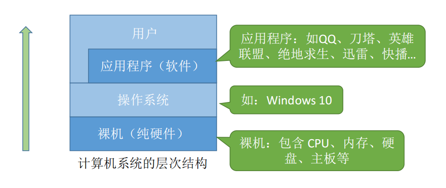
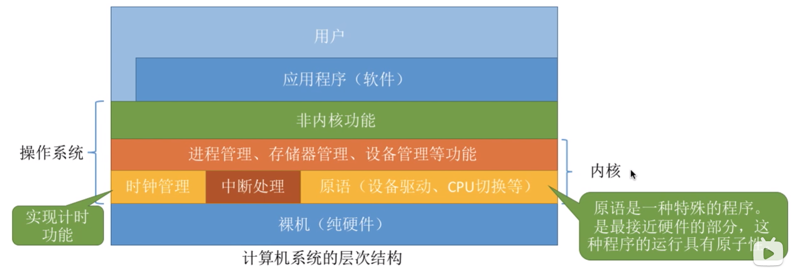

# 操作系统概述

## 操作系统基本概念

### 操作系统层次结构

### 概念

操作系统（Operating System， OS）是指控制和管理整个计算机系统的硬件和软件资源，并合理地组织调 度计算机的工作和资源的分配；以提供给用户和其他软件方便的接口和环境；它是计算机系统中最基本的系统软件

**①操作系统是系 统资源的管理者**

**②向上层提供方便易用的服务**

**③是最接近硬件的一层软件**

### 操作系统功能和目标

#### **系统资源的管理者**

- 文件管理
- 内存管理
- CPU管理
- I/O设备管理

Step 1：在各个文件夹中找到 QQ 安装的位置（如 D:/Tencent/QQ/Bin）

- 逐层打开文件夹，找到QQ.exe这个程序（可执行文件）的存 放位置

Step 2：双击打开 QQ.exe

- 需要把该程序相关数据放入内存

Step 3：QQ 程序正常运行

- 对应的进程被处理机（CPU）处理

Step 4：开始和朋友视频聊天

- 需要将摄像头设备分配给进程

#### **向上层提供方便易用的服务**

#### **作为操作系统硬件之间的接口**

> 通过输入命令控制硬件

**提供的功能**

- 命令接口（用户直接使用）
  - 联机命令接口：用户说一句，系统做一句---**控制命令窗口**
  - 脱机命令接口（批处理命令接口）：用户说一堆，系统做一堆---**bat脚本**
- 程序接口（用户通过程序调用间接使用）
  - 由一组系统调用组成（程序接口=系统调用=广义指令）---**.dll文件**
- GUI（图形界面）

#### **作为最接近硬件的层次**

**需要实现对硬件机器的拓展** 

没有任何软件支持的计算机成为裸机。在裸机上安装的操作系统， 可以提供资源管理功能和方便用户的服务功能，将裸机改造成功能 更强、使用更方便的机器 

通常把覆盖了软件的机器成为扩充机器，又称之为**虚拟机** 

### 操作系统特征

并发、共享（两个最基本特征，二者互为存在条件）

虚拟、异步

#### 并发

指两个或多个事件在同一时间间隔内发生。这些事件宏观上是同时发生的，但微观上是交替发生的。

**并行**：指两个或多个事件在同一时刻同时发生。

**注意：** 

单核CPU同一时刻只能执行一个程序，各个程序只能并发地执行 

多核CPU同一时刻可以同时执行多个程序，多个程序可以并行地执行

#### 共享

共享即资源共享，是指系统中的资源可供内存中多个并发执行的进程共同使用

- 互斥共享
  - 系统中的某些资源，虽然可以提供给多个进程使用，但**一个时间段内只允许一个进程访问该资源**
- 同时共享
  - 系统中的某些资源，允许**一个时间段 内由多个进程“同时”对它们进行访 问** 

所谓的“同时”往往是宏观上的，而在微观上，这些进程可能是交替地对该资源进行访问的（即分时共享）

#### 并发与共享

**并发性**指计算机系统中同时存在着多个运行着的程序。 

**共享性**是指系统中的资源可供内存中多个并发执行的进程共同使用。

如果失去并发性，则系统中只有一个 程序正在运行，则共享性失去存在的下意义

如果失去共享性，则QQ和微信不能同时访问硬盘资源，就无法实现同时发 送文件，也就无法并发

#### 虚拟

**虚拟**是指把一个物理上的实体变为若干个逻辑上的对应物。物理实体（前者）是实际存在的，而逻辑上对应物（后者）是用户感受到的。

虚拟技术中的**“空分复用技术”** ：实际只有4GB的内存，在用户看来似乎远远大于4GB---**虚拟存储器**

虚拟技术中的“**时分复用技术**”。微观上处理机在各个微小的时间段内交替着为各个进程服务---**虚拟处理器**

#### 异步

异步是指，在多道程序环境下，允许多个程序并发执行，但由于资源有限，进程的执行不是一贯到底的，而是**走走停停**，以不可预知的速度向前推进，这就是进程的异步性。

如果失去了并发性，即系统只能串行地 运行各个程序，那么每个程序的执行会一贯到底。只有系统拥有并发性，才有可能导致异步性。

### 操作系统发展与分类

下一代操作系统出现解决上一代的问题

1. 手工操作阶段
   1. 优点：
   2. 缺点：用户独占全机、人机速度矛盾导致资源利用率极低
2. 批处理阶段：引入**脱机输入/输出技术**（用外围机+磁带完成），并由**监督程序**负责控制作业的输入、输出
   1. 优点：缓解了一定程度的人机速度矛盾，资源利用率有所提升。
   2. 缺点：内存中仅能有一道程序运行，只有该程序运行结束之后才能调入下一道程序CPU有大量的时间是在空闲等待I/O完成。资源利用率依然很低。
3. **多道批处理系统**：每次输入多道程序
   1. 优点：**多道程序并发执行**，共享计算机资源。资源利用率大幅提升，CPU和其他资源更能保持“忙碌”状态，系统吞吐量增大。
   2. 缺点：用户响应时间长，没有人机交互功能。（用户提交自己的作业之后就只能等待计算机处理完成，中间不能控制自己的作业执行。
4. 分时操作系统：计算机以**时间片为单位轮流**为各个用户/作业服务，各个用户可通过终端与计算机进行交互。
   1. 优点：用户请求可以被即时响应，解决了人机交互问题。
   2. 缺点：不能优先处理一些紧急任务。操作系统对各个用户/作业都是完全公平的，循环地为每个用户/作业服务一个时间片，不区分任务的紧急性。
5. 实时操作系统
   1. 优点：能够优先响应一些紧急任务，某些紧急任务不需时间片排队。及时性和可靠性
   2. 分类
      1. 硬实时系统：绝对严格时间内完成。导弹控制系统、自动驾驶系统
      2. 软实时系统：能接受偶尔延时。12306火车订票系统
6. 网络操作系统
   1. 是伴随着计算机网络的发展而诞生的，能把网络中各个计算机有机地结合起来，实现数据传 送等功能，实现网络中各种资源的共享（如文件共享）和各台计算机之间的通信。（如：Windows NT 就是 一种典型的网络操作系统，网站服务器就可以使用）
7. 分布式操作系统
   1. 主要特点是分布性和并行性。系统中的各台计算机地位相同，任何工作都可以分布在这些 计算机上，由它们并行、协同完成这个任务
8. 个人计算机操作系统
   1. 如 Windows XP、MacOS，方便个人使用。

### 操作系统运行机制和体系结构

#### 运行机制

**指令：**处理器(CPU)能识别、执行的最基本命令

> 一条高级语言代码可能对应多条指令

- 特权指令：不允许用户使用。内存清零指令
- 非特权指令：普通的运算指令

**CPU如何判断当前是否可以执行特权指令？**

**处理器状态：**

- 用户态（目态）：非特权指令
- 核心态（管态）：都可执行

> 用程序状态字寄存器(PSW)中的某标志位来标识当前处理器处于什么状态。如0为用户态，1为核心态

**两种程序：**

- 内核程序
- 应用程序

#### 操作系统内核

内核是计算机上配置的底层软件，是操作系统最基本、最核心的部分。

实现操作系统内核功能的那些程序就是内核程序。

操作系统内核

1. 时钟管理：实现计时功能
2. 中断处理：负责实现中断机制
3. 原语：
   1. 是一种特殊程序
   2. 处于操作系统最底层，是最接近硬件的部分
   3. 原子性-运行一气呵成，不可中断
   4. 运行时间较短、调用频繁
4. 对系统资源进行管理的功能
   1. 进程管理
   2. 存储器管理
   3. 设备管理

#### 操作系统体系结构

**大内核和微内核**

**大内核：**

- 将操作系统的主要功能模块都作为系统内核，运行在核心态
- 优点：高性能
- 缺点：内核代码庞大，结构混乱，难以维护

**微内核：**

- 只把最基本的功能保留在内核（时钟管理、中断管理）
- 优点：内核功能少，结构清晰，方便维护
- 缺点：需要频繁地在核心态和用户态之间切换，性能低

### 中断和异常

引入中断机制，实现了多道程序并发执行

**中断的作用**：“中断”会使CPU由用户态变为内核态，使操作系统重新夺回对CPU的控制权

“中断”是让操作系统内核夺回CPU使用权的唯一途径

**内核态->用户态：**执行一条特权指令——修改PSW的标志位为“用户态”，这个动作意味着操作系统将主动让出CPU使用权 

**用户态->内核态：**由“中断”引发，硬件自动完成变态过程，触发中断信号意味着操作系统将强行夺回CPU的使用权

**中断的分类：**

- 内中断：（异常、例外、陷入）
  - 与当前执行的指令有关，中断信号来源于**CPU内部**
  - 自愿中断--指令中断
  - 强迫中断
    - 硬件故障：缺页
    - 软件中断：整除0
- 外中断（中断）
  - 与当前执行的指令无关，中断信号来源于CPU外部
  - 外设请求：I/O
  - 人工干预：用户强行终止

