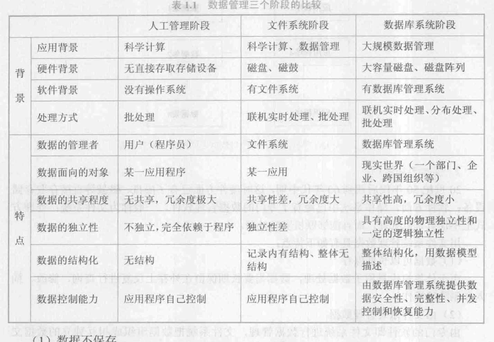
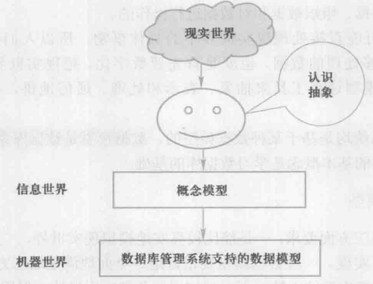

# 基础概念知识

数据库系统概论（第5版） by 王珊 萨师煊 

## 数据库的4个基本概念

**数据：**描述事物的符号记录称为数据

**数据库：**严格地讲，数据库是长期储存在计算机内、有组织的、可共享的大量数据的集合。数据库中的数据按一定的数据模型组织、描述和储存，具有较小的冗余度( redundancy)、较高的数据独立性(data independency)和易扩展(scalability), 并可为各种用户共享。

> 永久存储、有组织、可共享

**数据库管理系统** : 数据库管理系统(Database Management System 简称 DBMS)是一种操纵和管理数据库的大型软件，通常用于建立、使用和维护数据库。

**数据库系统：**数据库系统是由数据库、数据库管理系统( 及其应用开发工具)、应用程序和数据库管理员(DataBase Administrator, DBA)组成的存储、管理、处理和维护数据的系统。

## 数据管理技术产生与发展

**数据管理**是指对数据进行分类、组织、编码、存储、检索和维护，它是数据处理的中心问题。

**数据的处理**是指对各种数据进行收集、存储、加工和传播的一系列活动的总和。

**数据管理三个阶段的比较**

数据库系统的特点：数据结构化、数据的共享性高、冗余度低且易扩充、数据独立性高

> 数据共享可以大大减少数据冗余，节约存储空间。数据共享还能够避免数据之间的不相容性与不一致性。
>
> 物理独立性是指用户的应用程序与数据库中数据的物理存储是相互独立的。
>
> 逻辑独立性是指用户的应用程序与数据库的逻辑结构是相互独立的。

## 数据模型

数据模型(datamodel)也是一种模型，它是对现实世界数据特征的抽象。数据模型是数据库系统的核心和基础

### 概念模型

第一类概念模型(conceptual model), 也称信息模型，它是按用户的观点来对数据和信息建模，主要用于数据库设计。

**实体( entity)**：客观存在并可相互区别的事物称为实体。

**属性( attribute )；**实体所具有的某特性称为属性。

**码(key)：**唯一标识实体的属性集称为码。

**实体型(entity type )：**用实体名及其属性名集合来抽象和刻画同类实体，称为实体型。例如，学生(学号，姓名，性别，出生年月，所在院系，入学时间)就是一个实体型。

**实体集(entity set)：**同一类型实体的集合称为实体集。例如，全体学生就是一个实体集。

**联系( relationship )：**实体之间的联系通常是指不同实体集之间的联系。

实体之间的联系有一一对一、一对多和多对多等多种类型。

**概念模型表示方法**

实体联系方法(Entity-Relationship approach)。该方法用E-R图(E-R diagram) 来描述现实世界的概念模型，E-R方法也称为E-R模型。

### 逻辑模型和物理模型

第二类中的逻辑模型主要包括层次模型(hierarchical model)、网状模型(network model)、关系模型(relational model、面向对象数据模型(object oriented data model)和对象关系数据模型(object relational data model)、半结构化数据模型( semistructured data model)等。它是按计算机系统的观点对数据建模，主要用于数据库管理系统的实现。

> 数据库设计人员要了解和选择物理模型，最终用户则不必考虑物理级的细节。

### 数据模型的组成要素

一般地讲，数据模型是严格定义的一-组概念的集合。

数据模型通常由数据结构、数据操作和数据的完整性约束条件三部分组成。

**数据结构**：数据结构描述数据库的组成对象以及对象之间的联系。

**数据操作**：数据操作是指对数据库中各种对象(型)的实例(值)允许执行的操作的集合，包括操作及有关的操作规则。

> 查询、更新（包括插入、删除、修改）

**数据完整性约束条件**：数据的完整性约束条件是一组完整性规则

### 常用的数据模型

#### 层次模型

两个条件：

(1)有且只有一个结点没有双亲结点，这个结点称为根结点;

(2)根以外的其他结点有且只有一个双亲结点。

只能处理一对多联系。

**层次模型示例：**

层次模型的**优点**主要有:

(1)层次模型的数据结构比较简单清晰。

(2)层次数据库的查询效率高。

> B+树

(3)层次数据模型提供了良好的完整性支持。

**缺点**：

(1)现实世界中很多联系是非层次性的，如结点之间具有多对多联系，不适合用层次模型表示。

(2)如果一个结点具有多个双亲结点等，用层次模型表示这类联系就很笨拙，只能通过引入冗余数据(易产生不一致性)或创建非自然的数据结构(引入虚拟结点)来解决。

(3)查询子女结点必须通过双亲结点。

(4)由于结构严密，层次命令趋于程序化。

#### 网状模型

克服层次模型对现实世界描述的弊病

条件：

(1)允许一个以上的结点无双亲。

(2)一个结点可以有多于一个的双亲。

**优点：**

(1)能够更为直接地描述现实世界，如-一个结点可以有多个双亲，结点之间可以有多种联系。

(2)具有良好的性能，存取效率较高。

**缺点：**

(1)结构比较复杂，而且随着应用环境的扩大，数据库的结构就变得越来越复杂，不利于最终用户掌握。

(2)网状模型的DDL、DML复杂，并且要嵌入某一种高级语言(如COBOL、C)中。用户不容易掌握，不容易使用。

(3)由于记录之间的联系是通过存取路径实现的，应用程序在访问数据时必须选择适当的存取路径，因此用户必须了解系统结构的细节，加重了编写应用程序的负担。

#### 关系模型:flags:

##### 概念

每个关系的数据结构是一张规范化的二维表。

**关系(relation)**:--个关系对应通常说的一-张表

**元组(tuple)**: 表中的一行即为一个元组。（d, d2, .., dn)

**分量**:元组中的一个属性值。

**属性(attribute)**: 表中的一列即为一 个属性，给每- - 个属性起一个名称即属性名。

**码(key)**: 也称为码键。表中的某个属性组，它可以唯一确定一个元组

**域(domain)**:域是一组具有**相同数据类型**的值的集合。

一个域允许的不同取值个数称为这个域的**基数(cardinal number)**。

**关系模式**:对关系的描述，一-般表示为关系名(属性1,属性2，...， 属性n)

若关系中的某一属性组的值能唯一地标识一个元组，而其子集不能，则称该属性组为**候选码( candidate key)**。

候选码的诸属性称为**主属性(primeattribute)**。不包含在任何候选码中的属性称为**非主属性(non-prime attribute)**或非码属性( non-key attribute)。

关系模式所有属性性是这个关系模式的候选码，称为**全码(all-key)。**

##### 关系三种类型

关系可以有三种类型:基本关系(通常又称为基本表或基表)、查询表和视图表。

**基本表**是实际存在的表，它是实际存储数据的逻辑表示

**查询表**是查询结果对应的表

**视图表**是由基本表或其他视图表导出的表，是**虚表**，不对应实际存储的数据。

##### 优缺点

**优点**：

(1)关系模型与格式化模型不同，它是建立在严格的数学概念的基础上的。

(2)关系模型的概念单一。无论实体还是实体之间的联系都用关系来表示。对数据的检索和更新结果也是关系(即表)。所以其数据结构简单、清晰，用户易懂易用。

(3)关系模型的存取路径对用户透明，从而具有更高的数据独立性、更好的安全保密性，也简化了程序员的工作和数据库开发建立的工作。

**缺点**：

由于存取路径对用户是隐蔽的，查询效率往往不如格式化数据模型。

##### 关系模式

关系数据库中，关系模式是型，关系是值。

关系模式是对关系的描述

R(U, D, DOM, F)

其中R为关系名，U为组成该关系的属性名集合，D为U中属性所来自的域，DOM为属性向域的映像集合，F为属性间数据的依赖关系集合。

##### 关系代数:flags:

**传统集合运算**：传统的集合运算是二目运算，包括并、差、交、笛卡儿积4种运算。

**专门的关系运算**：专门的关系运算包括选择、投影、连接、除运算等。

**选择：**

**投影：**

关系R上的投影是从R中选择出若干属性列组成新的关系。投影操作是从**列**的角度进行的运算。

**连接**：

**除运算**

##### 关系完整性

**实体完整性( entity integrity)**：若属性(指一个或一-组属性) A是基本关系R的主属性，则A不能取空值(null value)。所谓空值就是“不知道”或“不存在”或“无意义”的值。

参照完整性(referential integrity)：针对外键

用户定义的完整性( user defined integrity）：用户自定义校验规则

## 数据库系统的结构

### 概念

**型**是指对某--类数据的结构和属性的说明，**值**是型的一个**具体赋值**。

**模式(schema)**是数据库中全体数据的逻辑结构和特征的描述，它仅仅涉及型的描述，不涉及具体的值。模式的一个具体值称为模式的一一个实例(instance)。 同一一个模式可以有很多实例。

### 三级模式两级映射:flags:

**模式(schema)**：模式也称逻辑模式，是数据库中全体数据的**逻辑结构和特征**的描述，是所有用户的公共数据视图。

> 它是数据库系统模式结构的中间层，既不涉及数据的物理存储细节和硬件环境，又与具体的应用程序、所使用的应用开发工具及高级程序设计语言无关。

**外模式(external schema)**：外模式也称子模式(subschema)或用户模式，它是数据库用户(包括应用程序员和最终用户)能够看见和使用的局部数据的逻辑结构和特征的描述，是数据库用户的**数据视图**，是与某一应用有关的数据的逻辑表示。

> 一个数据库可以有多个外模式

**内模式(storage schema)**：内模式也称存储模式(storage schema)， - 一个数据库只有一一个内模式。它是数据物理结构和存储方式的描述，是**数据在数据库内部的组织方式**。如使用hash、B+树等结构

**外模式/模式映像**：当模式改变时(例如增加新的关系、新的属性、改变属性的数据类型等)，由数据库管理员对各个外模式/模式的映像作相应改变，可以使外模式保持不变。应用程序是依据数据的外模式编写的，从而应用程序不必修改，保证了数据与程序的逻辑独立性，简称**数据的逻辑独立性**。

**模式/内模式映像**：

当数据库的存储结构改变时(例如选用了另一种存储结构)，由数据库管理员对模式/内模式映像作相应改变，可以使模式保持不变，从而应用程序也不必改变。保证了数据与程序的物理独立性，简称**数据的物理独立性**。

## 数据字典

数据字典是关系数据库管理系统内部的**一组系统表**，它**记录了数据库中所有的定义信息**，包括关系模式定义、视图定义、索引定义、完整性约束定义、各类用户对数据库的操作权限、统计信息等。关系数据库管理系统在执行SQL的数据定义语句时，实际上就是在更新数据字典表中的相应信息。在进行查询优化和查询处理时，数据字典中的信息是其重要依据。

## sql serve数据类型

https://docs.microsoft.com/zh-cn/sql/t-sql/data-types/data-types-transact-sql?view=sql-server-ver15

# 数据库核心知识点

## 范式（规范化的关系）

## SQL

> 具体语句见另一篇文章

### SQL特点

**综合统一**：

(1)模式数据定义语言( Schema Data Definition Language,模式DDL)。

(2)外模式数据定义语言(Subschema Data Definition Language,外模式DDL或子模式DDL)。

(3)数据存储有关的描述语言(Data Storage Description Language, DSDL)。

(4)数据操纵语言(Data Manipulation Language, DML)。	

**高度非过程化**：

用SQL进行数据操作时，只要提出“做什么”，而无须指明“怎么做”，因此无须了解存取路径。存取路径的选择以及SQL的操作过程由系统自动完成。这不但大大减轻了用户负担，而且有利于提高数据独立性。

**面向集合的操作方式**：

SQL采用集合操作方式，不仅操作对象、查找结果可以是元组的集合，而且一次插入、删除、更新操作的对象也可以是元组的集合。

**以同一种语法结构提供多种使用方式**

SQL语句能够嵌入到高级语言(例如C、C++、Java)程序中，供程序员设计程序时使用。而在两种不同的使用方式下，SQL的语法结构基本上是一一致的。

**语言简洁、易学易用**

SQL功能极强，但由于设计巧妙，语言十分简洁，完成核心功能只用了9个动词。SQL接近英语口语，因此易于学习和使用。

## 索引

如果学生较少，索引查找不一-定能提高查询效率， 系统仍会使用全表扫描。这由查询优化器按照某些规则或估计执行代价来作出选择。

