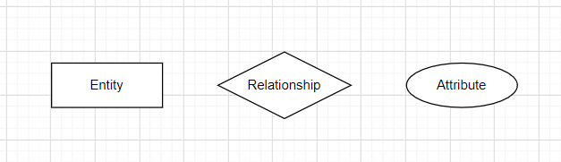

## E-R图

用于数据库概念模型的表示，描述实体之间的关系。

ER图分为实体、属性、关系三个核心部分。在ER图中，实体是长方形，属性是椭圆形，关系为菱形。

**实体：**即数据模型中的数据对象（即数据表）。

**属性：**即实体所具有的属性，例如学生具有姓名、学号、年级等属性

**关系：**用来表现数据对象与数据对象之间的联系

 1对1（1:1）、1对多（1:N）、多对多（M:N）