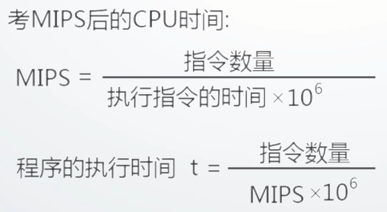

国家精品课程：华中科技大学 谭志虎

# 前言

## 为什么要学习计算机组成原理

核心专业基础课，在课程体系中承上启下的作用

后PC时代技术发展的迫切需求-专业地位更加凸显

国家战略的需要

## 如何学好计算机组成原理

构造观+系统观+工程观的学习视角和学习方法

- 如何设计功能部件:基本编码/解码器、运算器、控制器、存储器
- 如何设计系统:简单计算机系统	
- 利用仿真软件Logisim (开源)

系统观

- 理解计算机系统的构成及各部分之间的相互影响;
- 理解不同系统/结构对程序的影响影响(包括功能、性能、可移植性等方面)

工程观

- 如何高效实现所设计硬件功能部件或系统

# 第一章 概述

## 冯●诺依曼结构计算机工作原理及层次结构分析

冯 诺伊曼

因提出"离散变量自动电子计算机方案”- EDVAC (Electronic Discrete Variable Automatic Computer ), 被称为”计算机之父”，该方案至今仍为计算机设计者所遵循;

### **冯诺依曼计算机的工作原理**

两大部分：存储程序、程序控制

**存储程序**:将程序存放在计算机的存储器中;

**程序控制**:按指令地址访问存储器并取出指令，经译码依次产生指令执行所需的控制信号，实现对计算的控制完成指令的功能。

### **冯诺依曼计算机的组成(硬件+软件)**

硬件系统(总体图)

**主机**:CPU (运算器+控制器)、内存

**外设**:输入设备、输出设备、外存储器

**总线**:地址线、数据线、控制线

**运算器**：

算术运算(加减乘除)、逻辑运算(与、或、非、移位)、基本结构(ALU(Arithmetic Logical Unit 运算器)、寄存器、连接通路)

寄存器：存放参加运算的数据，保存运算结果

**控制器**：

产生指令执行过程所需要的所有控制信号,控制相关功能部件执行相应操作;

控制信号的形式：电平信号、脉冲信号。

产生控制信号的依据：指令、状态、时序

控制信号的产生方式：微程序、硬布线

**存储器**：

功能：存储原程序、原数据、运算中间结果;

工作模式：读/写

工作原理：读/写数据

- 容量 -> 地址线数量
- 1K --> 10
- 1M--> 20
- 1G --> 30

> 地址线与容量的计算

**输入设备**：向计算机输入数据(键盘、鼠标、网卡、扫描仪等)

**输出设备**：输出处理结果(显示器、声卡、网卡、打印机等)

**软件系统**：

可运行的思想和内容的数字化

- 思想:算法、规律、方法---程序表达
- 内容:图形、图像、数据、声音、文字等被处理的对象

软件的表现形式:程序和数据(以二进制表示的信息)

软件的核心:算法

**硬件和软件的关系**

1. 相互依存
   1. 硬件是软件运行的基础,软件的正常运行是硬件发挥作用的重要途径。计算机系统必须要配备完善的软件系统才能正常工作,且应充分发挥其硬件的功能;
2. 逻辑等效性
   1. 某些功能既可由硬件实现,也可由软件来实现
3. 协同发展
   1. 软件随硬件技术的迅速发展而发展，而软件的不断发展与完善又促进硬件的更新两者密切地交织发展，缺一不可

## 计算机系统性能评价

### 非时间指标

1)**机器字长**:指机器次能处理的二 进制位数

- 由加法器、寄存器的位数决定;
- 一般与**内部寄存器**的位数相等(字长)
- 字长越长,表示数据的范围就越大,精确度越高
- 目前常见的有32位和64位字长

**总线宽度**:数据总线- 次能并行传送的最大信息位数

- 一般指运算器与存储器之间的数据总线位数
- 有些计算机内部与外部数据总线宽度不一致
- 8086、80286、80386内外数据总线等宽;
- 8088、80386SX 外部总线宽度8位内部总线宽度16位

3)**主存容量与存储带宽**

**主存容量**:是指一台计算机主存所包含的存储单元总数。

**存储带宽**:指单位时间内与主存交换的二进制信息量，常用单位B/s (字节/秒)。(影响存储带宽的指标包括数据位宽和数据传输速率)。

### 时间指标

1)**主频f/时钟周期T ,外频、倍频**

**主频f**：指CPU内核工作的时钟频率,即CPU内数字脉冲信号振荡的速率，与CPU实际的运算能力之间不是唯一的、直接关系;

**时钟周期**：(主频的倒数)也称节拍周期，是计算机中最基本的、最小的时间单位。在一个时钟周期内，CPU仅完成一一个最基本的动作;

**f与T的关系**

互为倒数，f越高 , T就越小(f =100MHz时T=10ns，f =1GHz时T= 1ns)。

**外频**：指CPU(内存)与主板之间同步的时钟频率;

**倍频**：CPU主频与外频之间的倍数

主频=外频x倍频

**2) CPI (Clock cycles Per Instruction)**

**执行一条指令(平均)需要的时钟周期数(即T周期的个数)**

单条指令CPI、-段程序中所有指令的CPI、指令系统CPI等（作用范围是可变的）

CPI =程序中所有指令的时钟周期数之和/程序中指令总数

= `累加符号`(程序中各类指令的CPI x程序中该类指令的比例)

IPC (Instruction per Clock)：每个时钟周期内执行的指令条数(并行)

**3)MIPS (Million Instructions Per Second)**

每秒钟CPU能执行的指令总条数(单位:百万条/秒)

MIPS=指令条数/执行时间*10^6

**4) CPU时间**

执行一段程序所需的时间

( CPU时间+ I/O时间+存储访问时间+各类排队时延等)

CPU时间=程序中所有指令的时钟周期数之和x T=程序中所有指令的时钟周期数之和/ f

**CPU时间计算方法**

考虑CPI

## 计算机性能测试

**性能测试的目的**：

- 全面了解所测试计算机的性能
- 实时掌握计算机的工作状态
- 为对比、评估、维护提供依据

**测试基本原理**：

测试程序通过读取相应寄存器的值得到系统运行的状况

**测试工具**：

**CPU测试工具**

CPUmark :综合CPU测试，包括系统存储,浮点运算和逻辑运算

SysID :测试CPU电压,运行频率, L1、L2 Cache以及各项技术资料

Hot CPU Tester :可测试机器稳定性,尤其是超频后的稳定性，还可当烤机软件来运行

**显卡测试工具**

3DMark :除衡量显卡性能外，已渐渐转变成一款衡 量整机性能的软件

**硬盘测试工具**

**Hard Disk Speed** :硬盘测速软件

**Disk Benchmark** :通过对不同大小的数据块对磁盘读/写速度的影响，检测硬盘、U盘、存储卡及其它可移动磁盘的读/写入速率

**iometer** :可被配置为基准测试程序的磁盘和网络I/O的负载,可测试磁盘和网络控制器的性能、总线带宽和时延等参数

**内存测试软件**

CTSPD :选择主板厂商及型号后可详细测试内存的信息

Memory Speed:通过读写不同大小的块状数据来测试内存的性能

Memory Transfer Timing Utility :通过对源文件和目标文件进行校正和非校正复制,测试内存的读、写速率

## 计算机的层次结构

Computer hierarchy

不同用户在不同的层次

不同层次有不同属性：高级语言:C

不同层次使用不同的工具

## 概念

**透明性概念**：本来存在的事物或属性,从某个角度去看，却好像不存在;

**系统观**：当硬件结构发生变化时要想到可能对软件产生的影响。不同类型的软件对硬件有不同的要求。.编程的CPU硬件相关性,编程应查阅对应CPU的编程手册。

**软硬件的分界线**：分界线即软、硬件的接口, 是指令操作硬件的接口。指令格式及指令的设计与硬件关联

# 第二章 数据表示

## 机器数及特点

### **为什么研究机器内的数据表示**

1)目的:组织数据,方便计算机硬件直接使用。

2)要考虑的因素

- 支持的数据类型;
- 能表示的数据范围;
- 能表示的数据精度;
- 存储和处理的代价;
- 是否有利于软件的移植等

### 机器内数据表示

1. **真值**：符号用"+"、"-"表示的数据表示方法
2. **机器数**：符号数值化的数据表示方法,用0、 1表示符号。
3. 三种常见机器数

**原码**：原码就是符号位加上真值的绝对值

> [+1]原 = 0000 0001
>
> [-1]原 = 1000 0001

八位二进制取值范围：

[-127 , 127]

原码是人脑最容易理解和计算的表示方式.

**运算复杂**: 符号位不参加运算,要设置加法、减法器。

> 两个原码做运算：运算之前要进行判断
>
> 异号：实际做的是减法运算
>
> 同号：加法运算

0表示不唯一

**带来问题**：由于有+0和负零不能实现完全的自动化，而要进行人工的干预

**反码**：

正数的反码是其本身

负数的反码是在其原码的基础上, 符号位不变，其余各个位取反.

> [+1] = [00000001]原 = [00000001]反
>
> [-1] = [10000001]原 = [11111110]反

可见如果一个反码表示的是负数, 人脑无法直观的看出来它的数值. 通常要将其转换成原码再计算.

**运算相对原码简单**:符号位参加运算,只需要设置加法器,但符号位的进位位需要加到最低位。

0的表示不唯一：

**补码**：

正数的补码就是其本身

负数的补码是在其原码的基础上, 符号位不变, 其余各位取反, 最后+1. (即在反码的基础上+1)

> [+1] = [00000001]原 = [00000001]反 = [00000001]补
>
> [-1] = [10000001]原 = [11111110]反 = [11111111]补

对于负数, 补码表示方式也是人脑无法直观看出其数值的. 通常也需要转换成原码在计算其数值.

运算简单:只需设置加法器。

**0的表示唯一**

**补码中模的概念( 符号位进位后所在位的权值)**

**移码**：

移码表示浮点数的阶码，IEEE754中阶码用移码表示。

具体实现:数值位与X的补码相同,符号位与补码相反。

**用0和1来表示符号**

## 定点与浮点数据表示

### 定点数据表示

可表示定点小数和整数

数据表示范围受限

### 浮点数据表示

把数的范围和精度分别表示的一种数据表示方法。

**浮点数的使用场合**

当数的表示范围超出了定点数能表示的范围时。

(1)格式(一-般格式)

E:**阶码**位数决定**数据的范围**

M:尾数位数,决定数的精度

表示格式不足：不同系统可能根据自己的浮点数格式从中提取不同位数的阶码

(2)IEEE 754格式

指数采用偏移值,其中单精度**偏移值为127** ,**双精度为1023**，将浮点数的阶码值变成非负整数,便于浮点数的比较和排序。

## 数据校验基本原理

### 数据校验的必要性

受元器件的质量、电路故障或噪音干扰等因素的影响,数据在被处理、传输、存储的过程中可能出现错误;