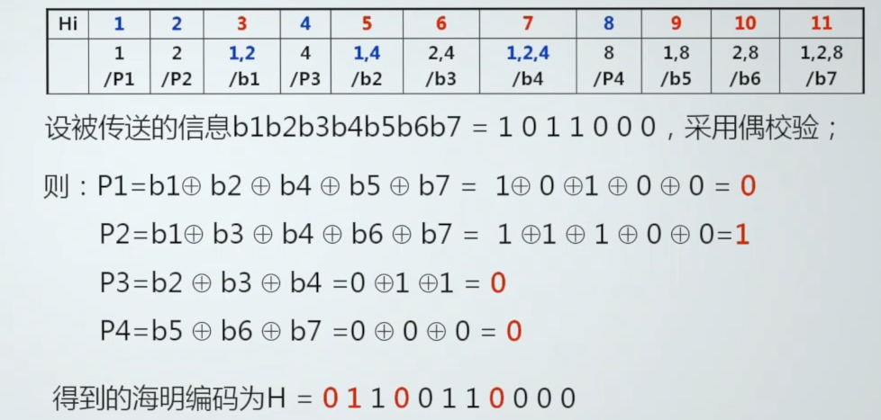
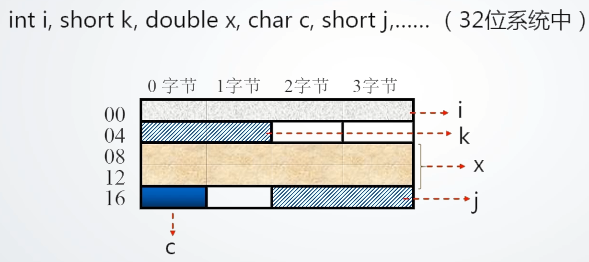
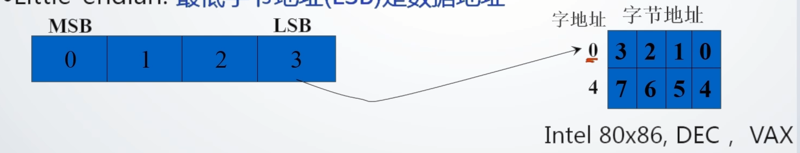

国家精品课程：华中科技大学 谭志虎

计算机组成原理 唐朔飞

# 前言

## 为什么要学习计算机组成原理

核心专业基础课，在课程体系中承上启下的作用

后PC时代技术发展的迫切需求-专业地位更加凸显

国家战略的需要

## 如何学好计算机组成原理

构造观+系统观+工程观的学习视角和学习方法

- 如何设计功能部件:基本编码/解码器、运算器、控制器、存储器
- 如何设计系统:简单计算机系统	
- 利用仿真软件Logisim (开源)

系统观

- 理解计算机系统的构成及各部分之间的相互影响;
- 理解不同系统/结构对程序的影响影响(包括功能、性能、可移植性等方面)

工程观

- 如何高效实现所设计硬件功能部件或系统

# 第一章 概述

## 冯●诺依曼结构计算机工作原理及层次结构分析

冯 诺伊曼

因提出"离散变量自动电子计算机方案”- EDVAC (Electronic Discrete Variable Automatic Computer ), 被称为”计算机之父”，该方案至今仍为计算机设计者所遵循;

### **冯诺依曼计算机的工作原理**

两大部分：存储程序、程序控制

**存储程序**:将程序存放在计算机的存储器中;

**程序控制**:按指令地址访问存储器并取出指令，经译码依次产生指令执行所需的控制信号，实现对计算的控制完成指令的功能。

### **冯诺依曼计算机的组成(硬件+软件)**

硬件系统(总体图)

**主机**:CPU (运算器+控制器)、内存

**外设**:输入设备、输出设备、外存储器

**总线**:地址线、数据线、控制线

**运算器**：

算术运算(加减乘除)、逻辑运算(与、或、非、移位)、基本结构(ALU(Arithmetic Logical Unit 运算器)、寄存器、连接通路)

寄存器：存放参加运算的数据，保存运算结果

**控制器**：

产生指令执行过程所需要的所有控制信号,控制相关功能部件执行相应操作;

控制信号的形式：电平信号、脉冲信号。

产生控制信号的依据：指令、状态、时序

控制信号的产生方式：微程序、硬布线

**存储器**：

功能：存储原程序、原数据、运算中间结果;

工作模式：读/写

工作原理：读/写数据

- 容量 -> 地址线数量
- 1K --> 10
- 1M--> 20
- 1G --> 30

> 地址线与容量的计算

**输入设备**：向计算机输入数据(键盘、鼠标、网卡、扫描仪等)

**输出设备**：输出处理结果(显示器、声卡、网卡、打印机等)

**软件系统**：

可运行的思想和内容的数字化

- 思想:算法、规律、方法---程序表达
- 内容:图形、图像、数据、声音、文字等被处理的对象

软件的表现形式:程序和数据(以二进制表示的信息)

软件的核心:算法

**硬件和软件的关系**

1. 相互依存
   1. 硬件是软件运行的基础,软件的正常运行是硬件发挥作用的重要途径。计算机系统必须要配备完善的软件系统才能正常工作,且应充分发挥其硬件的功能;
2. 逻辑等效性
   1. 某些功能既可由硬件实现,也可由软件来实现
3. 协同发展
   1. 软件随硬件技术的迅速发展而发展，而软件的不断发展与完善又促进硬件的更新两者密切地交织发展，缺一不可

## 计算机系统性能评价

### 非时间指标

1)**机器字长**:指机器次能处理的二 进制位数

- 由加法器、寄存器的位数决定;
- 一般与**内部寄存器**的位数相等(字长)
- 字长越长,表示数据的范围就越大,精确度越高
- 目前常见的有32位和64位字长

**总线宽度**:数据总线- 次能并行传送的最大信息位数

- 一般指运算器与存储器之间的数据总线位数
- 有些计算机内部与外部数据总线宽度不一致
- 8086、80286、80386内外数据总线等宽;
- 8088、80386SX 外部总线宽度8位内部总线宽度16位

3)**主存容量与存储带宽**

**主存容量**:是指一台计算机主存所包含的存储单元总数。

**存储带宽**:指单位时间内与主存交换的二进制信息量，常用单位B/s (字节/秒)。(影响存储带宽的指标包括数据位宽和数据传输速率)。

### 时间指标

1)**主频f/时钟周期T ,外频、倍频**

**主频f**：指CPU内核工作的时钟频率,即CPU内数字脉冲信号振荡的速率，与CPU实际的运算能力之间不是唯一的、直接关系;

**时钟周期**：(主频的倒数)也称节拍周期，是计算机中最基本的、最小的时间单位。在一个时钟周期内，CPU仅完成一一个最基本的动作;

**f与T的关系**

互为倒数，f越高 , T就越小(f =100MHz时T=10ns，f =1GHz时T= 1ns)。

**外频**：指CPU(内存)与主板之间同步的时钟频率;

**倍频**：CPU主频与外频之间的倍数

主频=外频x倍频

**2) CPI (Clock cycles Per Instruction)**

**执行一条指令(平均)需要的时钟周期数(即T周期的个数)**

单条指令CPI、-段程序中所有指令的CPI、指令系统CPI等（作用范围是可变的）

CPI =程序中所有指令的时钟周期数之和/程序中指令总数

= `累加符号`(程序中各类指令的CPI x程序中该类指令的比例)

IPC (Instruction per Clock)：每个时钟周期内执行的指令条数(并行)

**3)MIPS (Million Instructions Per Second)**

每秒钟CPU能执行的指令总条数(单位:百万条/秒)

MIPS=指令条数/执行时间*10^6

**4) CPU时间**

执行一段程序所需的时间

( CPU时间+ I/O时间+存储访问时间+各类排队时延等)

CPU时间=程序中所有指令的时钟周期数之和x T=程序中所有指令的时钟周期数之和/ f

**CPU时间计算方法**

考虑CPI

## 计算机性能测试

**性能测试的目的**：

- 全面了解所测试计算机的性能
- 实时掌握计算机的工作状态
- 为对比、评估、维护提供依据

**测试基本原理**：

测试程序通过读取相应寄存器的值得到系统运行的状况

**测试工具**：

**CPU测试工具**

CPUmark :综合CPU测试，包括系统存储,浮点运算和逻辑运算

SysID :测试CPU电压,运行频率, L1、L2 Cache以及各项技术资料

Hot CPU Tester :可测试机器稳定性,尤其是超频后的稳定性，还可当烤机软件来运行

**显卡测试工具**

3DMark :除衡量显卡性能外，已渐渐转变成一款衡 量整机性能的软件

**硬盘测试工具**

**Hard Disk Speed** :硬盘测速软件

**Disk Benchmark** :通过对不同大小的数据块对磁盘读/写速度的影响，检测硬盘、U盘、存储卡及其它可移动磁盘的读/写入速率

**iometer** :可被配置为基准测试程序的磁盘和网络I/O的负载,可测试磁盘和网络控制器的性能、总线带宽和时延等参数

**内存测试软件**

CTSPD :选择主板厂商及型号后可详细测试内存的信息

Memory Speed:通过读写不同大小的块状数据来测试内存的性能

Memory Transfer Timing Utility :通过对源文件和目标文件进行校正和非校正复制,测试内存的读、写速率

## 计算机的层次结构

Computer hierarchy

不同用户在不同的层次

不同层次有不同属性：高级语言:C

不同层次使用不同的工具

## 概念

**透明性概念**：本来存在的事物或属性,从某个角度去看，却好像不存在;

**系统观**：当硬件结构发生变化时要想到可能对软件产生的影响。不同类型的软件对硬件有不同的要求。.编程的CPU硬件相关性,编程应查阅对应CPU的编程手册。

**软硬件的分界线**：分界线即软、硬件的接口, 是指令操作硬件的接口。指令格式及指令的设计与硬件关联

# 第二章 数据表示

## 机器数及特点

### **为什么研究机器内的数据表示**

1)目的:组织数据,方便计算机硬件直接使用。

2)要考虑的因素

- 支持的数据类型;
- 能表示的数据范围;
- 能表示的数据精度;
- 存储和处理的代价;
- 是否有利于软件的移植等

### 机器内数据表示

1. **真值**：符号用"+"、"-"表示的数据表示方法
2. **机器数**：符号数值化的数据表示方法,用0、 1表示符号。
3. 三种常见机器数

**原码**：原码就是符号位加上真值的绝对值

> [+1]原 = 0000 0001
>
> [-1]原 = 1000 0001

八位二进制取值范围：

[-127 , 127]

原码是人脑最容易理解和计算的表示方式.

**运算复杂**: 符号位不参加运算,要设置加法、减法器。

> 两个原码做运算：运算之前要进行判断
>
> 异号：实际做的是减法运算
>
> 同号：加法运算

0表示不唯一

**带来问题**：由于有+0和负零不能实现完全的自动化，而要进行人工的干预

**反码**：

正数的反码是其本身

负数的反码是在其原码的基础上, 符号位不变，其余各个位取反.

> [+1] = [00000001]原 = [00000001]反
>
> [-1] = [10000001]原 = [11111110]反

可见如果一个反码表示的是负数, 人脑无法直观的看出来它的数值. 通常要将其转换成原码再计算.

**运算相对原码简单**:符号位参加运算,只需要设置加法器,但符号位的进位位需要加到最低位。

0的表示不唯一：

**补码**：

正数的补码就是其本身

负数的补码是在其原码的基础上, 符号位不变, 其余各位取反, 最后+1. (即在反码的基础上+1)

> [+1] = [00000001]原 = [00000001]反 = [00000001]补
>
> [-1] = [10000001]原 = [11111110]反 = [11111111]补

对于负数, 补码表示方式也是人脑无法直观看出其数值的. 通常也需要转换成原码在计算其数值.

运算简单:只需设置加法器。

**0的表示唯一**

**补码中模的概念( 符号位进位后所在位的权值)**

**移码**：

移码表示浮点数的阶码，IEEE754中阶码用移码表示。

具体实现:数值位与X的补码相同,符号位与补码相反。

**用0和1来表示符号**

## 定点与浮点数据表示

### 定点数据表示

可表示定点小数和整数

数据表示范围受限

### 浮点数据表示

把数的范围和精度分别表示的一种数据表示方法。

**浮点数的使用场合**

当数的表示范围超出了定点数能表示的范围时。

(1)格式(一-般格式)

E:**阶码**位数决定**数据的范围**

M:尾数位数,决定数的精度

表示格式不足：不同系统可能根据自己的浮点数格式从中提取不同位数的阶码

(2)IEEE 754格式

指数采用偏移值,其中单精度**偏移值为127** ,**双精度为1023**，将浮点数的阶码值变成非负整数,便于浮点数的比较和排序。

## 数据校验基本原理

### 数据校验的必要性

受元器件的质量、电路故障或噪音干扰等因素的影响,数据在被处理、传输、存储的过程中可能出现错误;

若能设计硬件层面的错误检测机制,可以减少基于软件检错的代价(系统观)。

### 校验基本原理

**增加冗余码（校验位）**

有效信息(k位) 校验信息(r位)

发送方对于发送的信息基于校验位去做某种运算得到一个编码，这里的编码既包括原始的数据，也包括基于规则计算出来的信息。接收方根据收到的信息和校验位再去执行与发送方相关的计算，去评测收到的这个数据是否出现错误。

不同校验编码有不同的检测能力

**码距**：同一编码中，任意两个合法编码之间**不同二进数位数的最小值**

0011与00Q1的码距为1 , 一位错误时无法识别

校验码中增加冗余项的目的就是为了增大码距.

**码距与检错纠错能力的关系**

> 为什么是这样？

1)码距≥e+1

可检测e个错误

码距>=2t+1

可纠正t个错误

3)码距≥e+t+1

可纠正t个错误,同时检测e个错误(e≥t)

码距越大,抗干扰能力越强,纠错能力越强,数据冗余越大编码效率低,编码电路也相对复杂;

选择码距必须考虑信息发生差错的概率和系统能容许的最小差错率

## 奇偶校验

奇偶校验的基本原理：校验位一位

**编码**：根据有效信息计算校验信息位,使校验码(数据+1位校验信息)中**1的个数满足奇/偶校验的要求**

“1”的个数满足奇偶校验的特征。

0001-->0001**1**(使得为偶校验)

0001-->0001**0**(使得为奇校验)

**奇偶校验特点**：

- 编码与检错简单
- 编码效率高
- 不能检测偶数位错误
- 不能定位错误，没有纠错能力

发现不了以下的错误

**改进奇偶校验**

双向奇偶校验

可纠正1位错误

可检测出某行(列)_上的奇数位;

可检出一部分偶数位错误

不能检测出错码分布在矩形4个顶点上的错误

**奇偶校验应用**

数字奇偶校验要实现到9位，9个颗粒的内存条

一般在同步传输方式中常采用奇校验 ,异步传输方式中常采用偶校验

## CRC校验

增加冗余码：校验信息(r位)

有效信息k位

**N=k+r≤2^r- 1**

一共设置r位校验位能够表示出2^r中状态，其中一种状态没有错误

**生成多项式**G(x)

收发双方约定的一一个(r + 1)位二进制数,发送方利用G(X)对信息多项式做模2除运算,生成校验码。接收方利用G(X)对收到的编码多项式做**模2除运算**检测差错及错误定位。

**G(x)应满足的条件**

- 最高位和最低位必须为1
- 当被传送信息( CRC码)任何- -位发生错误时,被生成多项式做除后应该使余数不为0
- 不同位发生错误时，模2除运算后余数不同
- 对不为0余数继续进行模2除运算应使余数循环.

**模2运算规则**

加/减运算(异或运算,加不进位, 减不借位)

0+0=0，0+1=1，1+0=1, 1+1=0，减法也相同

**模2除法**

按模2减,求部分余数，不借位。

. 上商原则

- 部分余数首位为1时，商为1，减除数;
- 部分余数首位为0时，商为0，减0 ;
- 当部分余数的位数小于除数的位数时，该余数即为最后余数。

模二除法示例

**CRC检错与纠错**

接收方利用G(X)对收到的编码多项式做模2除运算，**余数为0说明传输没有错误**

CRC应用标准非常多

## 海明校验

有效信息k位，校验信息r位

设k+ r位海明码从左到右依次为第1 , 2 , 3, .... k+r位, r位校验位记为P;(i=1, 2 , ... r) ,分别位于k+ r位海明编码的第2^i-1 ( i=1 , 2, ...，r)位上，其余位依次放置被校验的数据位;

举例

Hj位的数据被编号小于j的若干个海明位号之和等于j的校验位所校验

海明校验码举例：

> 异或操作

**海明校验码指错字为零并不一定代表没有错误**

一位错和两位错不能由指错字区别

# 第三章 运算方法与运算器

## 定点数的计算

### 定点数的加法运算

n是字长

**算法理解**

- 补码进行运算有很多优点
- 在进行计算的时候千万不要直接用二进制数去计算，一定要先变成补码

eg

### 定点数减法运算

基于加法器实现减法和加法

**规律**

通过右向左扫描[Y]补，在遇到数字1及之前 ，直接输出遇到的数字遇到1之后,取反输出，即可得到[-Y]补，反之亦然

### 数溢出的概念及其判断方法

**溢出**：运算结果超出了某种数据类型的表示范围。

溢出检测方法：溢出只可能发生在同符号数相加时,包括[X]补与[Y]补; [X]补 与[-Y]同号

**方法1** :对操作数和运算结果的符号位进行检测

当结果的符号位与操作数的符号不相同时就表明发生了溢出

**方法2** :对最高数据位进位和符号进位进行检测

**方法3** :用变型补码，双符号位

**溢出判断的软件方法**

对于流水线会引起停顿

**无符号数溢出的判断**

无符号数加法的溢出可用ALU的进位表示

无符号数减法的溢出也可用带加/减功能的ALU的进位取反后表示。

## 定点数补码加、减运算器设计

## 原码一位乘法:pensive:

**移位操作及其意义**

**逻辑左移**：

数据整体左移位,最高位D15被移出至CF ,最低位D1补0

移位前01101110

逻辑左移后 0 11011100

**算术左移**

数据整体左移-位，最高位D15被移至Cf , 最低位D1补0

移位前 01101110

逻辑左移后 0 11011100

**相当于乘二**

**逻辑右移**

数据整体右移一位,最高位D15补0 ,最低位D1被移出

**算术右移相当于除二**

**二进制乘法计算**

- 采用累加的方法

符号位单独参加运算,数据位取绝对值参加运算

**运算法则**

运算过程采用改进的乘法运算方法。

## 补码——位乘法:pensive:

补码运算的特点，符号位参加了运算

## 乘法运算器的设计

**原码——位乘法器设计**

# 第四章 存储系统

## 存储为核心？

I/O与存储器直接存取方式(DMA)

各处理机在相互通信中，需要共享存放在存储器中的数据

## 存储系统层次结构

> Redis为什么快？

**基本存储体系**

**原理**：

- 存储程序----->主存
- 程序控制----->CPU

1. 输入设备将程序与数据写入主存
2. CPU读取指令
3. CPU执行指令期间读数据
4. CPU回写运算结果
5. 输出设备输出结果

**问题**：

1. 主存速度慢的原因
   1. 主存增速与CPU增速不同步
   2. 指令执行期间多次访问存储器
2. 主存容量不足的原因
   1. 存在制约主存容量的技术因素
   2. 应用对主存的需求不断扩大
   3. 价格原因

**解决**：构建存储层次化结构

从CPU与其它存储器的角度看：CPU访问到的存储系统具有Cache的速度，辅存的容量和价格

在主存一辅存这一层次的不断发展中，形成了**虚拟存储系统**。对具有虚拟存储器的计算机系统而言，编程时可用的地址空间远远大于主存空间

**存储层次结构演化**

增加了L1 Cache和L2 Cache

- L1 Cache集成在CPU中,分数据Cache(D-Cache)和指令Cache(I-Cache )
- 早期L2 Cache在主板上或与CPU集成在同一-电路板上。随着工艺的提高L2Cache被集成在CPU内核中，不分D-Cache和I-Cache

**存储体系层次化结构的理论基础**

局部性原理

- 时间局部性
  - 现在被访问的信息在不久的将来还将再次被访问
  - 结构体现：循环结构
- 空间局部性
  - 现访问信息2，下一次访问2附近的信息
  - 结构体现：顺序结构

## 存储器分类

### 按在计算机中的作用(层次分类)

**主存储器：**

主存储器。简称主存，又称内存储器(内存)，用来存放计算机运行期间所需的程序和数据，CPU可以直接随机地对其进行访问，也可以和高速缓冲存储器(Cache)及辅助存储器交换数据。其特点是容量较小、存取速度较快、每位的价格较高。

**辅助存储器**。

简称辅存，又称外存储器(外存)，用来存放当前暂时不用的程序和数据，以及一些需要永久性保存的信息。辅存的内容需要调入主存后才能被CPU访问。其特点是容量大、存取速度较慢、单位成本低。

**高速缓冲存储器**。

简称Cache,位于主存和CPU之间，用来存放当前CPU经常使用的指令和数据，以便CPU能高速地访问它们。Cache的存取速度可与CPU的速度相匹配，但存储容量小、价格高。现代计算机通常将它们制作在CPU中。

### 按存储介质分类

存储介质是指能寄存“0”、“1”两种代码并能区别两种状态的物质或元器件。存储介质主要有半导体器件、磁性材料和光盘等。

**半导体存储器：**

由半导体器件组成的叫半导体存储器。优点是体积小、功耗低、存取时间短。电源消失存储信息丢失，近年有非易失型

**磁表面存储器**

磁表面存储器是在金属或塑料基体的表面上涂- - 层磁性材料作为记录介质，非易失

**磁芯存储器**

磁芯是由硬磁材料做成的环状元件，在磁心中穿有驱动线(通电流)和读出线，这样便可进行读写操作。不易失的永久记忆。磁心存储器的体积过大、工艺复杂、功耗太大

**光盘存储器**

光盘存储器是应用激光在记录介质(磁光材料)。上进行读写 的存储器,非易失，光盘记录密度高、耐用性好、可靠性高和可互换性强

### 按存取方式分类

**随机存储器RAM (Random Access Memory)**

RAM是一种**可读写**存储器

特点：存储单元内容随机存取；

计算机中主存采用RAM

由于存储信息原理的不同,RAM又分为静态RAM(以触发器原理寄存信息)和动态RAM (以电容充放电原理寄存信息)。

**只读存储器ROM (Read Only Memory)**

ROM只读不可写入，断电内容也不会丢失

通常用它存放固定不变的程序、常数以及汉字字库，甚至用于操作系统的固化。它与随机存储器可共同作为主存的部分， 统“构成**主存的地址域**。

**串行访问存储器**。

对存储单元进行读/写操作时，需按其物理位置的先后顺序寻址，包括顺序存取存储器(如磁带)与直接存取存储器(如磁盘、光盘)。

顺序存取存储器的内容只能按某种顺序存取，存取时间的长短与信息在存储体上的物理位置有关，其特点是存取速度慢。直接存取存储器既不像RAM那样随机地访问任何一一个存储单元，又不像顺序存取存储器那样完全按顺序存取，而是介于两者之间。存取信息时通常先寻找整个存储器中的某个小区域( 如磁盘上的磁道)，再在小区域内顺序查找。

### 按信息的可保存性分类

断电后，存储信息即消失的存储器，称为**易失性存储器**，如RAM。

断电后信息仍然保持的存储器，称为**非易失性存储器**，如ROM、磁表面存储器和光存储器。

若某个存储单元所存储的信息被读出时，原存储信息被破坏，则称为**破坏性读出**;

若读出时，被读单元原存储信息不被破坏，则称为**非破坏性读出**。具有破坏性读出性能的存储器，每次读出操作后，必须紧接-一个再生的操作，以便恢复被破坏的信息。

## 存储器性能指标

**存储容量**=存储字数x字长(如1Mx8 位)。单位换算: 1B (Byte, 字节) = 8b (bit,位)。存储字数表示存储器的地址空间大小，字长表示一次存取操作的数据量。

**地址线和数据线的位数共同反映存储芯片的容量**：地址线为10根，数据线为4根，则芯片容量为2^10*4=4K位

**单位成本**:每位价格=总成本/总容量。

**存储速度**:数据传输率=数据的宽度/存储周期。

**存取时间(T)**:存取时间是指从**启动一次存储器操作到完成该操作所经历的时间**,分为读出时间和写入时间。

**存取周期(Tm)**: 存取周期又称读写周期或访问周期。它是指存储器进行- -次完整的读写操作所需的全部时间，即连续两次独立访问存储器操作(读或写操作)之间所需的最小时间间隔。

**主存带宽(Bm**):主存带宽又称数据传输率，表示**每秒从主存进出信息的最大数量**,单位为字/秒、字节/秒(B/s) 或位/秒(b/s)。

存取时间不等于存储周期，通常存储周期大于存取时间。这是因为对任何- -种存储器，在读写操作之后，总要有-段恢复内部状态的复原时间。对于破坏性读出的存储器，存取周期往往比存取时间大得多，甚至可达Tm= 2T，因为存储器中的信息读出后需要马上进行再生。

## 主存储器

### 概述

MAR中的地址访问某个存储单元时，还需经过地址译码、驱动等电路，才能找到所需访问的单元。读出时，需经过读出放大器，才能将被选中单元的存储字送到MDR。写入时，MDR中的数据也必须经过写入电路才能真正写入到被选中的单元中。

### 主存中的数据组织

#### 存储字长

概念：主存的一个存储单元所包含的二进制位数

目前大多数计算机的主存**按字节编址**,存储字长也不断加大，如16位字长、32位字长和64位字长

ISA（Instruction Set Architecture 指令集架构）设计时要考虑的两个问题：

a)如何根据字节地址读取- -个32位的字? -字的存放问题

b)一个字能否存放在主存的任何字节边界?-字的边界对齐问题

#### 数据存储与边界的关系

**1)按边界对齐的数据存储**

边界对齐会导致部分空间的浪费

**2)未按边界对齐的数据存储**

虽节省了空间,但增加了访存次数

需要在性能与容量间权衡

> 变量x访问次数从两次变成了三次

**3)边界对齐与存储地址的关系(以32位为例)**

- 双字长数据边界对齐的起始地址的最末三位为00(8字节整数倍	？？
- 单字长边界对齐的起始地址的末二位为00(4字节整数倍)   ？？
- 半字长边界对齐的起始地址的最末一 位为0( 2字节整数倍)  ？？

**考虑下列两个结构声明**：

S1中由于要保证边界对齐，因此要按上图中的排列方式

这样去对比，S2的存储排列并没有比S1好多少

#### 大端与小端存储方式

**Big-endian:最高字节地址(MSB)是数据地址**

**Little-endian:最低字节地址(L SB)是数据地址**

### 随机存取存储器

#### 一些概念

**高电平**，指的是与[低电平](https://baike.baidu.com/item/低电平/6946314)相对的[高电压](https://baike.baidu.com/item/高电压/2278971)，是电工程上的一种说法。在逻辑电平中，保证逻辑门的输入为高电平时所允许的最小输入高电平，当输入电平高于输入高电压（Vih）时，则认为输入电平为高电平。

#### 静态RAM (Static RAM或记作SRAM)

触发器工作原理存储信息

通常把存放一个二进制位的物理器件称为存储元，它是存储器的最基本的构件。地址码相同的多个存储元构成-一个存储单元。若干存储单元的集合构成存储体。

静态随机存储器(SRAM)的存储元是用双稳态触发器(六晶体管MOS)来记忆信息的, 因此即使信息被读出后，它仍保持其原状态而不需要再生(非破坏性读出)。

SRAM的存取速度快，但集成度低，功耗较大，价格昂贵，- 般用于高速缓冲存储器。

##### **SRAM存储单元工作原理**

**说明**

数据写入后自然可被读出来

无论是读/写,都要求X和Y译码线同时有效

如果不是同时有效，无法同时打开，T5、6、7、8四个门控管，不能实现存储单元与外界的联系

##### 静态存储器的结构

单译码结构中，要同时连接X选通和Y选通，这样才能选中对应存储单元

双译码结构可以减少译码线的数量

片选信号有效时整个存储器才会工作

写操作WE非、读操作OE非为底电平有效

接地信号GND  

2114

行选择10根

##### 

