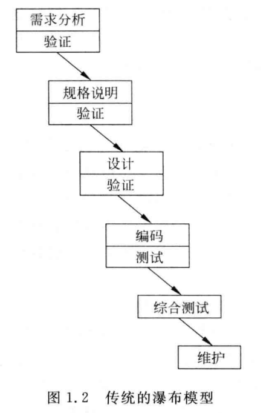
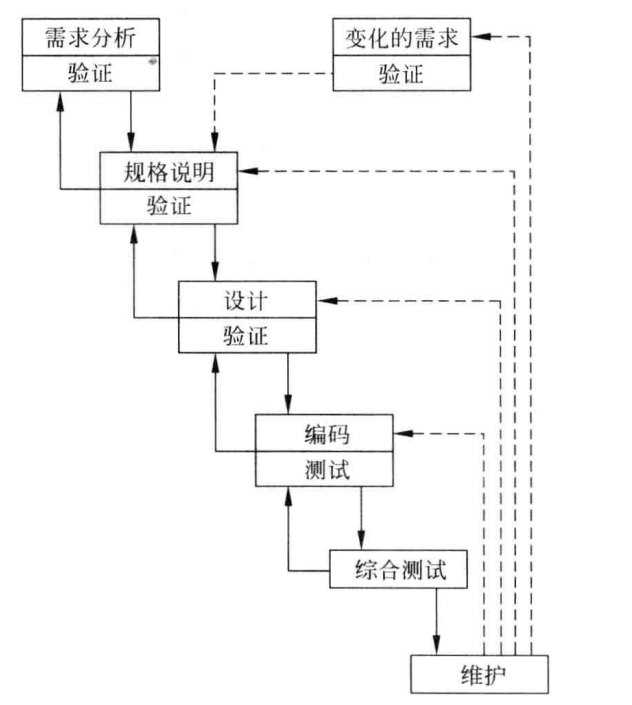
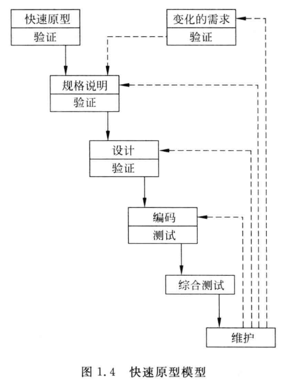
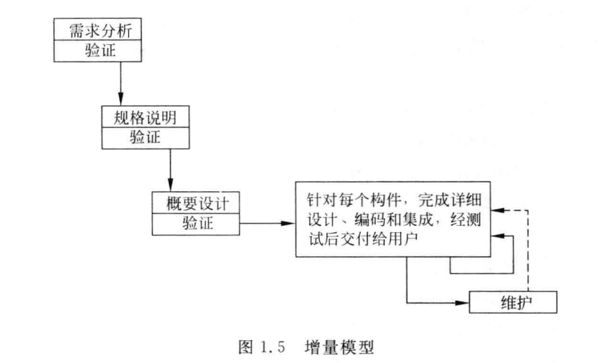
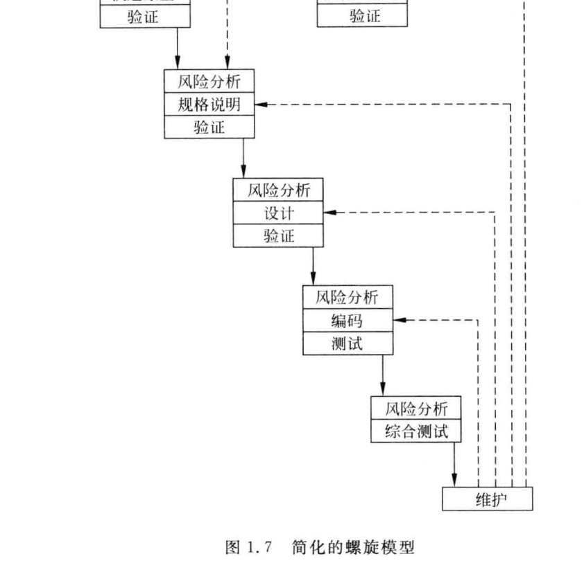

软件工程导论 by 张海藩 牟永敏 

软件工程之美-极客时间

# 软件工程学概述

## 为什么要学习软件工程？

软件项目的开发其实是一个工程，整个开发过程是可以有效组织起来的；对于开发过程的各个阶段，已经有很多解决问题的最佳实践，有很多方法来帮助我们高效完成任务；我们还可以借助工具来协助管理，提升开发效率。

提高软件的可维护性,减少软件维护的代价

## 软件危机

**两方面问题**：

- 开发软件满足软件日益增长的需求
- 维护数量不断膨胀的已有软件

**典型表现**：

- 对软件开发成本和进度的估计常常很不准确。
- 用户对“已完成的”软件系统不满意的现象经常发生。用户对软件需求是模糊的
- 软件产品的质量靠不住
- 软件常常不可维护
- 软件通常没有合适的文档资料
- 软件成本在计算机系统总成本中所占的比例逐年上升
- 软件开发生产率提高的速度,远远跟不上计算机应用迅速普及深入的趋势

产生软件危机原因：

- 软件本身特点
- 软件开发与维护方法不正确

程序只是完整的软件产品的一个组成部分。一个软件产品必须由一个完整的配置组成，软件配置主要包括程序、文档和数据等成分。

## 软件工程

软件工程是指导计算机软件开发和维护的一-门工程学科。

1968年在第- -届NATO会议上曾经给出了软件工程的一个早期定义:“软件工程就是为了经济地获得可靠的且能在实际机器上有效地运行的软件,而建立和使用完善的工程原理。”

1993年IEEE进一步给出了一个更全面更具体的定义:“软件工程是:①把系统的、规范的、可度量的途径应用于软件开发、运行和维护过程,也就是把工程应用于软件;②研究①中提到的途径。”

**特性**：

- 软件工程关注于大型程序的构造
- 软件工程的中心课题是控制复杂性--》可管理
- 软件经常变化
- 开发软件的效率非常重要
- 和谐地合作是开发软件的关键
- 软件必须有效地支持它的用户
- 在软件工程领域中通常由具有一种文化背景的人替具有另一-种文化背景的人创造产品

**软件工程基本原理**

- 确保软件产品质量和开发效率的原理的最小集合
- 用分阶段的生命周期计划严格管理
- 坚持进行阶段评审
- 实行严格的产品控制-->不随意改变需求
- 采用现代程序设计技术
- 结果应能清楚地审查-->规定开发组织的责任和产品标准
- 开发小组的人员应该少而精
- 承认不断改进软件工程实践的必要性

**软件工程方法学**

通常把在软件生命周期全过程中使用的一整套技术方法的集合称为方法学( methodology),也称为范型( paradigm)。在软件工程领域中,这两个术语的含义基本相同。

软件工程方法学包含3个要素:方法、工具和过程。

**方法**是完成软件开发的各项任务的技术方法,回答“怎样做”的问题;

**工具**是为运用方法而提供的自动的或半自动的软件工程支撑环境;

**过程**是为了获得高质量的软件所需要完成的一.系列任务的框架,它规定了完成各项任务的工作步骤。

**传统方法学**

传统方法学也称为生命周期方法学或结构化范型

这种方法学把软件生命周期的全过程依次划分为若干个阶段,然后顺序地完成每个阶段的任务。一步一步

**面向对象方法学**

当软件规模庞大,或者对软件的需求是模糊的或会随时间变化而变化的时候,使用传统方法学开发软件往往不成功,此外，使用传统方法学开发出的软件,维护起来仍然很困难。

软件可重用性更高

**面向对象方法学具有下述4个要点**

- 把对象(object)作为融合了数据及在数据上的操作行为的统-的软件构件
- 把所有对象都划分成类(class)。每个类都定义了--组数据和--组操作
- 按照父类(或称为基类)与子类(或称为派生类)的关系,把若千个相关类组成-一个层次结构的系统(也称为类等级)。
- 对象彼此间仅能通过发送消息互相联系

面向对象方法学的出发点和基本原则，是尽量模拟人类习惯的思维方式

## 软件生命周期

### 软件定义

> 软件定义时期的任务是:确定软件开发工程必须完成的总目标;确定工程的可行性;导出实现工程目标应该采用的策略及系统必须完成的功能;估计完成该项工程需要的资源和成本,并且制定工程进度表。这个时期的工作通常又称为系统分析,由系统分析员负责完成。

**问题定义**：要解决的问题是什么?

> 应该得到客户的确认

**可行性研究**：对于_上一个阶段所确定的问题有行得通的解决办法吗？

**需求分析**：为了解决这个问题，目标系统必须做什么，主要是确定目标系统必须具备哪些功能。

> 规格说明书

### 软件开发

**总体设计**（概要设计）：‘概括地说,应该怎样实现目标系统。设计程序的体系结构，也就是确定程序由哪些模块组成以及模块间的关系。

> 从集中可能的方案中选出最佳方案

**详细设计**:总体设计阶段以比较抽象概括的方式提出了解决问题的办法。应该怎样具体地实现这个系统呢?'确定实现模块功能所要的算法和数据结构。

**编码**：这个阶段的关键任务是写出正确的容易理解、容易维护的程序模块。

**单元测试**：这个阶段的关键任务是通过各种类型的测试(及相应的调试)使软件达到预定的要求。

### 运行维护

主要任务是使软件持久地满足用户的需要

**通常有4类维护活动:**

- 改正性维护，也就是诊断和改正在使用过程中发现的软件错误;
- 适应性维护,即修改软件以适应环境的变化;
- 完善性维护,即根据用户的要求改进或扩充软件使它更完善;
- 预防性维护,即修改软件,为将来的维护活动预先做准备。

## 软件过程

软件过程是为了获得高质量软件所需要完成的一-系列任务的框架,它规定了完成各项任务的工作步骤。

概括地说,软件过程描述为了开发出客户需要的软件,什么人(who).在什么时候(when)、做什么事(what)以及怎样(how)做这些事以实现某-一个特定的具体目标。

过程定义了运用方法的顺序、应该交付的文档资料、为保证软件质量和协调变化所需要采取的管理措施，以及标志软件开发各个阶段任务完成的里程碑。为获得高质量的软件产品,软件过程必须科学、有效。

### 瀑布模型

结构化方法中的模型，是结构化的开发，开发流程如同瀑布一般，一步一步的走下去，直到最后完成项目开发，只适用于需求明确或者二次开发（需求稳定**)**，当需求不明确时，最终开发的项目会错误，有很大的缺陷。 项目规模大、开发小组对项目需 求理解并了解相关领域，因此可以采用瀑布开发模型。

### 原型

与瀑布模型相反，原型针对的就是需求不明确的情况，首先快速构造一个功能模型，演示给用户看，并按用户要求及时修改，中间再通过不断的演示与用户沟通，最终设计出项目，就不会出现与用户要求不符合的情况，采用的是迭代的思想。不适合超大项目开发。

### 增量模型

**首先开发核心模块功能**，而后与用户确认，之后再开发次核心模块的功能，由于并不是从系统整体角度规划各个模块，因此不利于模块划分。难点在于如何将客户需求划分为多个增量。与原型不用的是增量模型的每一次增量版本都可作为独立可操作的作品**,** 而原型的构造一般是为了演示。 软件需求不明确 

增量式开发的**主要优点**包括：

1.由于能够在较短的时间内向用户提交一些有用的工作产品，因此能够解决用户的一些急用功能。

2.由于每次只提交用户部分功能，用户有较充分的时间学习和适应新的产品。

3.对系统的可维护性是一个极大的提高，因为整个系统是由一个个构件集成在一起的，当需求变更时只变更部分部件，而不必影响整个系统。

**主要缺点**包括：

1.由于各个构件是逐渐并入已有的软件体系结构中的，所以加入构件必须不破坏 已构造好的系统部分，这需要软件具备开放式的体系结构。

2.在开发过程中，需求的变化是不可避免的。增量模型的灵活性可以使其适应这种变化的能力大大优于瀑布模型和快速原型模型，但也很容易退化为边做边改模型，从而使软件过程的控制失去整体性。

3.如果增量包之间存在相交的情况且未很好处理，则必须

### 螺旋模型

是多种模型的混合，针对需求不明确的项目，与原型类似，但是增加了**风险分 析**，这也是其最大的特点。适合大型项目开发。兼顾了快速原型的迭代的特征以及瀑布模 型的系统化与严格监控 

### **V**模型

特点是增加了很多轮测试，并且这些测试贯穿于软件开发的各个阶段，不像其他模型都是软件开发完再测试，很大程度上保证了项目的准确性。

### 统一过程模型

UP （统一过程）模型是一种以用例和风险为驱动、以架构为中心、迭代并且增量的开发过

程

：是一种用例和风险驱动，以架构为中心，迭代并且增量的开发方法，定义了不同阶段及制品。

- 起始阶段专注于项目的初创活动。 
- 精化阶段理解了最初的领域范围之后，进行需求分析和架构演进。 
- 构建阶段关注系统的构建，产生实现模型。 
- 移交阶段关注于软件提交方面的工作，产生软件增量。 
- 产生阶段运行软件并监控软件的持续使用，提供运行环境的支持，提交并评估缺陷报告和变更请求

